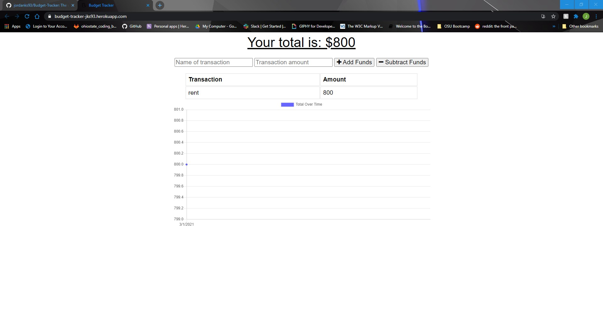

# Budget Tracker

  ## Description
  The user will be able to add expenses and deposits to their budget with or without a connection. When entering transactions offline, they should populate the total when brought back online. [Heroku Link](https://budget-tracker-jks93.herokuapp.com/)
  
  

  ## Table of Contents
  * [Installation](#installation)
  * [Credits](#credits)
  * [Contributions](#contributions)
  * [Questions](#questions)
  * [License](#license)
   
  ## Installation
  #### Requires 
  * mongoDB
  * node
  * express

  1) Clone the repo from github 
  2) Pull up the project in your file directory 
  3) Enter "npm i" into the terminal to install the required modules 
  4) Enter "node server.js" to run the program 
  5) Enter "localhost:3010" into your browser to open the app 
  ## Credits
  Jordan Stuckman
  ## Contributions
  Contact me by email or just submit a pull request.
  ## Questions
  If you have any questions or feedback, contact me at jordanks93@gmail.com.
  My github profile is jordanks93.
  ## License
  MIT